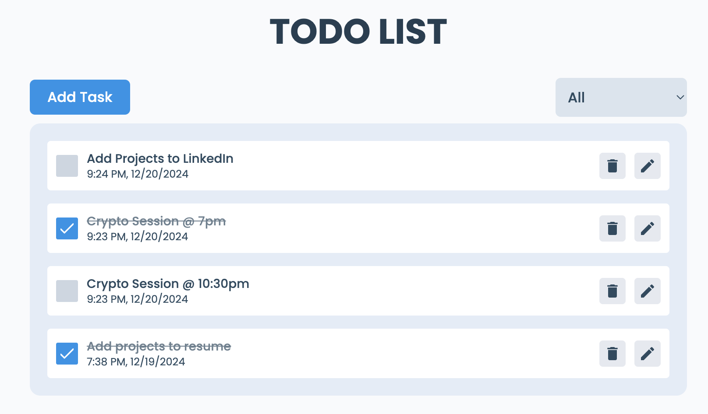

# Todo App

A complete todo application with all features.

**live demo: [coddeve-todo-app](https://coddeve-todo-app.netlify.app/)**

### Made with ❤️ by Suraj Gupta!

---

## Project Description

In the project, I have created a Complete Todo Application with all features. I have done all the CRUD operations. I have used `React.js` and `Redux` to manage our states.

## Techs used

- [React](https://reactjs.org/)
- [React Redux](https://redux.js.org/)
- [Framer Motion](https://framer.com/motion/)
- [React icons](https://react-icons.netlify.com/)
- [React Hot Toast](https://react-hot-toast.com/)
- More...

## Getting Started

Go the file directory and run

```shell
npm install
```

and after that start the dev server.

```shell
npm start
```

## Tools Used

1. Favicon: [Flaticon.com](https://www.flaticon.com/)
1. Code Editor: [VS Code](https://code.visualstudio.com/)

---
